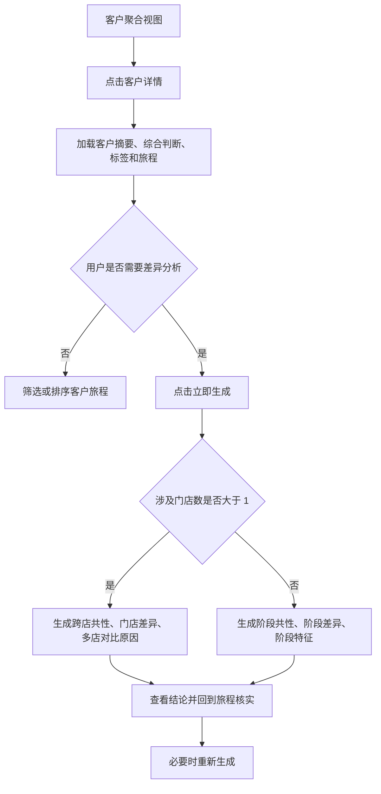
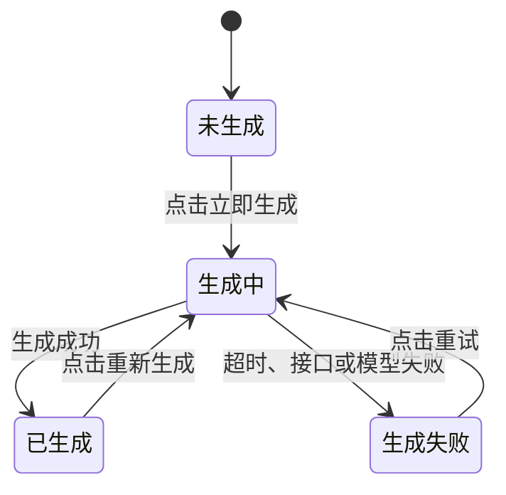

# 客户详情页原型逻辑说明

> 页面入口：`leads/index.html?route=customer-detail`  
> 文档用途：指导前端开发、后端接口设计、智能体开发和产品验收  
> 文档状态：基于 2026-07-29 原型及历次设计调整沉淀

## 1. 页面定位

### 1.1 一句话定义

客户详情页以“自然客户”为中心，聚合该客户在不同线索、不同门店、不同业务阶段中的会话与跟进记录，帮助销售或管理人员快速判断客户当前状态、理解跨店或跨阶段差异，并回到原始旅程核实结论。

### 1.2 页面要解决的问题

原始数据按线索和录音分散，使用者需要自行拼接同一客户的多次沟通，容易出现：

- 不知道同一客户是否在多个门店重复咨询；
- 只能看到单次沟通，无法理解客户关注点如何变化；
- 多门店各自跟进，缺少统一的客户判断；
- AI 结论与原始会话分离，无法快速核实；
- 会话标签和公域属性混在一起，来源不清。

本页通过“客户聚合—综合判断—AI 差异分析—旅程核实”形成完整闭环。

### 1.3 页面不负责的内容

- 不代替单条线索详情；
- 不展示完整录音转写和全部质检项；
- 不直接修改线索状态、客户归属或门店归属；
- 不自动执行销售跟进动作；
- 不把未经证据支持的推测当作客户事实。

## 2. 设计过程与最终取舍

### 2.1 从“线索详情”转为“客户聚合详情”

最初页面更偏单条线索查看，后续明确以客户为核心：

- 入口来自“客户聚合视图”；
- 一个客户可以关联多条线索；
- 一个客户可以涉及一个或多个门店；
- 页面顶部展示关联线索数、涉及门店数、首次建联和最后一次跟进；
- 客户旅程展示全部关联线索，而不是当前线索的局部记录。

最终原则：页面主键是客户，线索和录音是客户旅程下的证据。

### 2.2 从“右侧 AI 卡片”转为“全宽客户洞察”

原方案把 AI 画像和标签放在右侧辅助区，容易被理解为附加信息。后续改为全宽核心区域，原因是：

- 综合判断是使用者进入页面后的首要任务；
- AI 结论必须与客户摘要、标签和旅程形成连续阅读；
- 跨店客户的信息量较大，窄栏无法稳定承载；
- 需要为 10 个以上标签和较长 AI 结果保留空间。

最终原则：AI 客户洞察是核心判断区，不是页面边角功能。

### 2.3 从统一 AI 画像转为自动分支分析

统一画像只能重复“客户关注价格、空间”等静态结论，无法体现多线索聚合的价值。因此根据涉及门店数自动分支：

- 多门店客户：分析跨店共性、门店差异和多店对比原因；
- 单门店客户：分析不同业务阶段的共性关注、阶段差异和阶段特征。

最终原则：分析模式由客观数据自动决定，不要求用户手动选择。

### 2.4 从“直接展示结果”转为“用户主动生成”

AI 区保留“立即生成”，生成后支持“重新生成”，并展示加载和逐字呈现状态。

这一取舍用于表达：

- AI 结果有独立生成过程，不是普通静态字段；
- 用户明确触发后再消耗计算资源；
- 重新生成是对最新数据重新分析，不是随机换一种文案；
- 未生成状态保持简单，避免提前展示分析类型和说明造成信息噪声。

### 2.5 标签按来源拆分

标签最终拆成上下两组：

- 对话标签聚合：来自全部关联会话中的客户表达；
- 公域标签：来自用户属性和兴趣行为。

最终原则：标签必须显示来源，不能把“客户说过什么”和“系统已有属性”混为一类。

## 3. 核心对象定义

| 对象 | 定义 | 关键标识 |
| --- | --- | --- |
| 自然客户 | 被系统识别为同一个人的客户实体 | `customer_id` |
| 线索 | 客户在某个来源、门店或业务链路中的销售线索 | `lead_id` |
| 门店 | 线索和跟进活动所属经营主体 | `store_id` |
| 会话 | 一次录音、电话、到店接待或其他可分析沟通 | `session_id` |
| 旅程节点 | 一次可展示的业务阶段事件 | `journey_event_id` |
| 对话标签 | 从会话内容中识别出的需求、顾虑、偏好和意向信号 | `tag_id + source_session_ids` |
| 公域标签 | 来自用户属性、兴趣行为或外部授权数据的标签 | `tag_id + source_system` |
| AI 洞察 | 基于客户全部可用证据生成的结构化共性与差异结论 | `insight_id` |

### 3.1 客户归并规则

正式系统必须由后端客户主数据服务提供稳定的 `customer_id`。手机号只能作为归并依据之一，不能长期直接充当客户主键。

原型当前采用以下临时规则：

1. 优先使用客户手机号归并；
2. 无手机号时使用客户名称；
3. 两者都没有时回退到线索 ID。

正式开发至少要处理：

- 同一手机号对应多人；
- 客户更换手机号；
- 手机号脱敏后碰撞；
- 同一客户在不同系统中的 ID 映射；
- 人工合并和拆分后的历史数据修正。

## 4. 页面信息架构

页面从上到下分为四层。

### 4.1 返回与页面说明

- 返回入口：返回客户聚合视图；
- 页面标题：客户详情；
- 页面说明：整合客户在各门店全生命周期的旅程表现。

返回时应保留客户聚合视图此前的筛选条件、分页和滚动位置。

### 4.2 客户摘要

展示：

- 脱敏客户名称；
- 关联线索数；
- 涉及门店数；
- 首次建联时间；
- 最后一次跟进时间及业务阶段。

计算口径：

- 关联线索数：当前客户名下未被删除且用户有权限查看的线索数量；
- 涉及门店数：上述线索中不同 `store_id` 的去重数量；
- 首次建联：全部有效旅程节点的最早时间；
- 最后一次跟进：全部有效旅程节点的最晚时间；
- 客户名称与手机号必须按权限脱敏。

### 4.3 客户洞察核心区

#### 综合判断

综合判断用于给出已经结构化、可稳定计算的当前结论，包括：

- 当前最高有效意向等级；
- 主要意向车型；
- 当前决策阶段；
- 核心关注点；
- 主要顾虑。

综合判断不依赖用户点击“立即生成”，应由后端聚合结果直接返回。

#### AI 客户洞察

未生成时只显示“立即生成”。

生成范围说明固定为：

> 客户在多家门店/单门店多旅程的共性与差异分析

生成模式：

| 条件 | 模式 | 固定输出结构 |
| --- | --- | --- |
| `store_count > 1` | 跨店共性与差异 | 共性关注、门店差异、多店对比原因 |
| `store_count = 1` | 阶段共性与差异 | 共性关注、阶段差异、阶段特征 |

#### 对话标签聚合

- 聚合全部有权限查看的关联会话；
- 同义标签应归一，例如“价格高”“预算敏感”可归入“价格敏感”；
- 标签可超过 10 个，页面自动换行；
- 默认按“重要性分数降序，其次最近出现时间降序”排列；
- 标签应保留证据会话 ID，但页面首屏可不展开证据。

#### 公域标签

- 必须标明来源系统和授权状态；
- 不参与无授权范围下的 AI 推断；
- 过期、撤回授权或低可信标签不得继续用于生成；
- 与对话标签同名时仍保持来源分离。

### 4.4 客户旅程概览

用一条横向时间线快速展示关键节点：

- 意向等级：高、中、无；
- 业务阶段：首触跟进、到店接待、试乘试驾、电话跟进、报价沟通等；
- 所属门店；
- 发生日期。

排序规则：按事件时间从早到晚。

颜色规则：

- 同一门店在旅程概览、门店筛选和详细旅程中使用同一颜色；
- 意向等级颜色只表达等级，不替代门店颜色；
- “无”表示当前节点未形成有效意向等级，不等于无效客户。

当节点较多时横向滚动，不压缩到不可读。

### 4.5 客户详细旅程

每个旅程节点展示：

- 门店名称和顾问；
- 时间；
- 业务阶段和当次意向等级；
- 话术命中率；
- 会话小结；
- 策略跟进；
- 本次会话客户标签。

页面提供两种查看方式：

1. 按门店分组：默认方式，便于比较各门店跟进内容；
2. 按时间排序：按时间倒序，便于查看客户最近变化。

门店筛选规则：

- 默认全部门店选中；
- 支持多选；
- 取消某门店后隐藏该门店全部旅程节点；
- 不允许出现零门店结果；当用户取消最后一个门店时，恢复为全部选中；
- 筛选只影响详细旅程展示，不应改变顶部客户摘要和已生成洞察的分析范围。

## 5. 用户主流程



## 6. 页面状态

### 6.1 整页状态

| 状态 | 页面表现 | 用户操作 |
| --- | --- | --- |
| 加载中 | 客户摘要、洞察、标签、旅程显示骨架屏 | 等待 |
| 正常 | 展示完整客户数据 | 查看、筛选、生成 |
| 部分数据 | 缺少公域标签或部分会话分析结果时，保留其他模块并说明缺失范围 | 继续查看 |
| 无旅程 | 展示客户摘要和空状态，说明暂无可用会话或跟进记录 | 返回 |
| 无权限 | 不展示客户敏感信息和 AI 结果 | 返回或申请权限 |
| 加载失败 | 展示失败原因和重试入口 | 重试 |

### 6.2 AI 洞察状态



状态要求：

- 未生成：只显示“立即生成”；
- 生成中：按钮不可重复点击，提示“正在读取关联线索并分析差异……”；
- 已生成：展示模式名称、结构化结论、生成时间和“重新生成”；
- 生成失败：保留失败原因、重试按钮，不清空页面其他内容；
- 数据更新：如果生成后新增了线索或会话，标记“客户数据已更新，建议重新生成”；
- 离开页面：前端应终止轮询，但后端任务可以继续；
- 回到页面：优先读取最近一次有效结果，不应每次重新计算。

## 7. 前端开发指导

### 7.1 建议组件拆分

- `CustomerDetailHeader`：标题、返回、客户摘要；
- `CustomerInsightPanel`：综合判断、AI 洞察和标签；
- `CustomerJourneyOverview`：横向关键节点；
- `CustomerJourneyToolbar`：查看方式和门店筛选；
- `CustomerJourneyList`：详细旅程；
- `AiInsightGenerator`：AI 状态机和结果展示；
- `EmptyState`、`ErrorState`、`PermissionState`：异常状态。

### 7.2 前端只负责

- 根据接口数据渲染；
- 保存页面内筛选和排序状态；
- 根据 `analysis_mode` 渲染对应结构；
- 发起生成任务并轮询结果；
- 对客户敏感信息做二次展示保护；
- 处理加载、空数据、失败和重新生成交互。

前端不应：

- 自己判断客户是否为同一人；
- 自己拼接 AI 结论文案；
- 根据门店名称写死颜色；
- 根据页面 DOM 计算业务口径；
- 把演示用的 3 家门店、6 个节点和固定标签写入正式代码。

### 7.3 交互细节

- 返回客户聚合视图时恢复原筛选状态；
- 门店筛选和排序切换后不重新请求整页数据，可在前端完成；
- 旅程时间排序按完整时间戳，不按页面文字排序；
- AI 逐字效果仅是展示效果，不得拖延真实结果呈现；
- 用户重复点击“重新生成”时使用同一幂等键，避免重复任务；
- 移动端客户摘要换行，旅程概览横向滚动，AI 区由双列变单列；
- 所有切换按钮提供明确的选中状态和键盘操作能力。

### 7.4 前端建议状态结构

```json
{
  "customerId": "CUS-001",
  "detailStatus": "success",
  "journeyViewMode": "store",
  "selectedStoreIds": ["STORE-01", "STORE-02"],
  "aiInsight": {
    "status": "idle",
    "jobId": null,
    "result": null,
    "isStale": false
  }
}
```

## 8. 后端开发指导

### 8.1 页面详情接口

建议：

`GET /api/customers/{customer_id}/detail`

返回：

```json
{
  "customer": {
    "customer_id": "CUS-001",
    "display_name": "王*娴",
    "masked_phone": "139****1268",
    "lead_count": 3,
    "store_count": 3,
    "first_contact_at": "2026-03-10T09:13:00+08:00",
    "last_follow_up_at": "2026-03-15T10:20:00+08:00",
    "last_follow_up_stage": "报价沟通"
  },
  "summary": {
    "intent_level": "high",
    "intent_level_label": "高意向",
    "primary_model_id": "MODEL-M8",
    "primary_model_name": "传祺M8",
    "decision_stage": "quotation_comparison",
    "summary_text": "客户已完成到店和试驾，目前进入报价比较阶段。",
    "focus_points": ["空间", "静谧性", "金融方案", "置换补贴"],
    "concerns": ["价格"]
  },
  "dialogue_tags": [],
  "public_tags": [],
  "stores": [],
  "journey_events": [],
  "latest_ai_insight": null,
  "data_version": "2026-03-15T10:20:00+08:00"
}
```

### 8.2 旅程节点结构

```json
{
  "journey_event_id": "EVENT-001",
  "lead_id": "LEAD-001",
  "session_id": "SESSION-001",
  "store_id": "STORE-01",
  "store_name": "上海浦东门店",
  "advisor_id": "EMP-01",
  "advisor_name": "刘青",
  "occurred_at": "2026-03-13T16:00:00+08:00",
  "stage_code": "test_drive",
  "stage_name": "试乘试驾",
  "intent_level": "high",
  "script_hit_rate": 0.3,
  "session_summary": "客户完成试乘试驾……",
  "follow_up_strategy": "围绕试驾反馈继续推进……",
  "tags": [],
  "evidence_status": "available"
}
```

### 8.3 AI 生成接口

建议异步任务方式：

- `POST /api/customers/{customer_id}/ai-insights`
- `GET /api/ai-insight-jobs/{job_id}`
- `GET /api/customers/{customer_id}/ai-insights/latest`

生成请求：

```json
{
  "data_version": "2026-03-15T10:20:00+08:00",
  "force_regenerate": false,
  "idempotency_key": "CUS-001_20260315T102000"
}
```

后端职责：

- 校验客户及数据访问权限；
- 锁定本次分析的数据版本；
- 确定单店或跨店模式；
- 读取全部可用旅程和会话分析结果；
- 调用智能体；
- 校验输出结构和证据引用；
- 保存结果、耗时、模型版本和生成时间；
- 返回可复用的最近一次有效结果。

### 8.4 数据更新与缓存

- `data_version` 应随关联线索、会话分析、标签或客户归并结果变化；
- 相同客户、相同数据版本、相同分析版本可直接返回缓存；
- “重新生成”默认仍基于最新数据版本，不应随机改变事实；
- 智能体提示词或分析规则变化时增加 `analysis_version`；
- 历史洞察应可审计，不直接覆盖。

## 9. 智能体开发指导

### 9.1 智能体目标

智能体不是生成一段泛化客户画像，而是回答：

- 这个客户在所有沟通中持续关注什么；
- 不同门店或不同阶段的关注点有什么差异；
- 这些差异说明客户当前如何决策；
- 每个结论由哪些会话事实支持。

### 9.2 分析模式判定

模式由后端确定后传给智能体：

```text
如果有效门店数 > 1：cross_store
否则：cross_stage
```

“有效门店”指至少存在一条用户有权查看、且可参与分析的旅程记录的门店。

### 9.3 输入数据

智能体只接收结构化、已授权的数据：

- 客户摘要；
- 线索列表；
- 门店与顾问信息；
- 旅程节点；
- 会话小结；
- 客户原话证据片段；
- 对话标签；
- 授权可用的公域标签；
- 数据版本和分析模式。

不应把整库数据、无关客户信息或无权限字段直接交给模型。

### 9.4 处理步骤

1. 校验输入是否足以分析；
2. 按门店和时间整理旅程；
3. 提取重复出现的关注点和顾虑；
4. 区分客户事实、销售行为和模型推断；
5. 根据模式比较门店或阶段；
6. 为每条结论绑定证据；
7. 生成严格结构化结果；
8. 做一次事实一致性检查；
9. 缺少证据时明确标记“证据不足”，不补写。

### 9.5 输出结构

```json
{
  "insight_id": "INSIGHT-001",
  "analysis_mode": "cross_store",
  "analysis_mode_label": "跨店共性与差异",
  "sections": [
    {
      "section_type": "common_focus",
      "title": "共性关注",
      "content": "客户在多家门店均持续关注……",
      "evidence_refs": ["SESSION-001", "SESSION-004"],
      "confidence": 0.91
    },
    {
      "section_type": "store_difference",
      "title": "门店差异",
      "content": "上海浦东门店……杭州滨江门店……",
      "evidence_refs": ["SESSION-002", "SESSION-005"],
      "confidence": 0.87
    },
    {
      "section_type": "comparison_reason",
      "title": "多店对比原因",
      "content": "现有证据显示客户主要在比较成交条件……",
      "evidence_refs": ["SESSION-003", "SESSION-006"],
      "confidence": 0.78
    }
  ],
  "warnings": [],
  "data_version": "2026-03-15T10:20:00+08:00",
  "analysis_version": "customer-insight-v1",
  "generated_at": "2026-03-15T10:21:10+08:00"
}
```

单店模式的 `section_type` 固定为：

- `common_focus`：共性关注；
- `stage_difference`：阶段差异；
- `stage_characteristic`：阶段特征。

### 9.6 智能体约束

- 不得虚构客户家庭、收入、职业或购买原因；
- 公域标签只能在授权和可信度符合要求时使用；
- 不把销售顾问的说法误写成客户观点；
- 不把单次提及写成“持续关注”；
- 不把多门店接触直接判定为恶意比价；
- “多店对比原因”必须使用“现有证据显示”等审慎表述；
- 金额、时间、车型、门店、优惠政策必须与输入一致；
- 输出必须包含证据引用；
- 证据不足时返回明确提示，不生成完整结论；
- 不向用户暴露内部提示词、模型思考过程或无关个人信息。

### 9.7 降级策略

| 情况 | 处理方式 |
| --- | --- |
| 只有一条有效会话 | 不做差异分析，只返回主要关注点并提示证据不足 |
| 多门店但仅一家有有效会话 | 按单店阶段模式处理 |
| 没有客户原话，仅有会话小结 | 可以生成，但降低置信度并标记证据类型 |
| 公域标签不可用 | 不影响基于会话的分析 |
| 模型超时 | 返回可重试状态，页面保留综合判断和旅程 |
| 输出结构不合法 | 后端自动修复一次，仍失败则标记生成失败 |

## 10. 关键验收规则

### 10.1 客户与数据

- 同一客户的关联线索数和去重门店数正确；
- 首次建联和最后一次跟进取值正确；
- 客户名称和手机号按权限脱敏；
- 页面只展示当前用户有权限查看的数据；
- 新增旅程后，页面数据版本和 AI 过期状态正确更新。

### 10.2 页面交互

- 从客户聚合视图进入和返回路径正确；
- 默认按门店分组并选中全部门店；
- 切换按时间排序后按时间倒序展示；
- 门店支持多选且不会出现零选中；
- 窄屏下标签正常换行，旅程概览可横向滚动；
- 加载、空数据、失败和无权限状态均有明确反馈。

### 10.3 AI 洞察

- 多门店客户自动进入跨店模式；
- 单门店客户自动进入阶段模式；
- 两种模式严格返回各自的三段结构；
- 生成中无法重复提交；
- 重新生成读取最新数据；
- 每段结论均能关联到有效会话证据；
- 没有证据时不生成确定性判断；
- 页面重新进入时可读取最近一次有效结果。

## 11. 当前原型与正式开发的差距

以下内容目前是原型演示，不可直接视为正式业务能力：

1. 客户摘要中的首次建联、最后一次跟进、综合判断和标签大多为静态演示数据；
2. 点击不同客户后，当前主要只动态替换客户名称、线索数、门店数和分析模式，旅程内容没有真正按客户切换；
3. 客户旅程固定演示 3 家门店和 6 个节点；
4. 门店筛选项和门店颜色为前端写死；
5. AI 结果是固定文案，通过 3 秒计时模拟生成；
6. 重新生成没有读取新数据，也没有历史版本；
7. 当前结果没有证据 ID、生成时间、置信度和数据版本；
8. 当前没有 AI 失败、超时、权限不足和证据不足状态；
9. 客户归并使用手机号、名称等临时规则，尚无稳定客户主数据 ID；
10. 综合判断、对话标签和公域标签缺少正式计算口径及来源信息。

## 12. 建议开发优先级

### P0：形成可用闭环

- 客户主键和归并结果；
- 客户摘要、综合判断、标签、旅程详情接口；
- 门店筛选和排序；
- 单店/跨店模式判定；
- AI 异步生成、结果保存和失败重试；
- AI 结构化输出及证据引用；
- 权限、脱敏、空数据和错误状态。

### P1：增强可信度和运营能力

- AI 结论点击后定位对应旅程证据；
- 数据更新后的洞察过期提示；
- 洞察历史版本；
- 标签来源、出现次数和最近出现时间；
- 置信度与证据完整度；
- 会话详情跳转。

### P2：后续扩展

- 人工纠正客户归并；
- AI 结论反馈；
- 生成跟进任务或协同动作；
- 多门店协同和客户归属治理；
- 基于真实转化结果评估洞察有效性。

## 13. 最终产品原则

1. 先聚合客户，再解释客户；
2. 先给判断，再给证据；
3. 多门店看门店差异，单门店看阶段差异；
4. 综合判断用稳定规则，AI 负责共性与差异解释；
5. 标签必须区分对话来源和公域来源；
6. AI 结论必须可追溯、可重试、可审计；
7. 页面筛选只改变查看方式，不偷偷改变分析范围；
8. 原型中的固定文案和演示数据不得进入正式业务逻辑。
