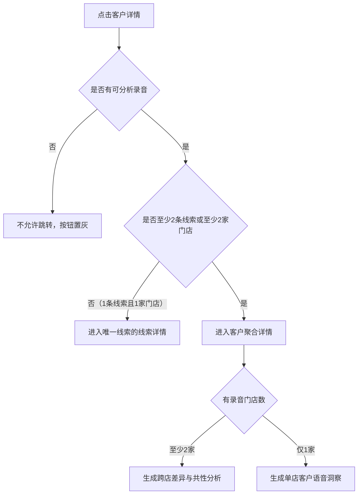

# 客户聚合视图规则

> 文档状态：目标业务规则（开发、测试与产品验收统一口径）
> 版本：V1.13
> 更新日期：2026-08-12
> 适用页面：`leads/index.html` 中的“客户聚合视图”及 `?route=customer-detail` 客户详情
> 关联文档：`docs/customer-detail-prototype-logic.md`

## 1. 文档目的

本文档统一说明客户聚合视图的客户归并、指标计算、筛选、列表展示、详情跳转、客户当前状态、录音覆盖、AI 语音洞察、标签和语音轨迹规则。

## 2. 页面定位

### 2.1 一句话定义

客户聚合视图以“自然客户”为中心，将同一客户的多条线索、多个门店和关联录音汇总在一起，帮助用户识别跨店客户、了解客户最新状态。已进入客户聚合详情且至少有 1 条可分析录音时，支持生成 AI 综合语音洞察。

### 2.2 页面负责

- 将同一自然客户的多条线索聚合为一行；
- 展示关联线索数、关联门店数、关联录音数、录音覆盖和客户关联概况；
- 区分单线索与多线索客户、非跨门店与跨门店客户；
- 有可分析录音且仅 1 条线索、1 家门店的客户进入线索详情；
- 有可分析录音且关联 2 条及以上线索或关联 2 家及以上门店的客户进入客户聚合详情；
- 无可分析录音的客户不支持进入任何详情页面；
- 已进入客户聚合详情且至少有 1 条可分析录音时，支持生成 AI 综合语音洞察；
- 提供客户当前最新状态、标签和可核实的录音旅程。

## 3. 核心对象与字段口径

### 3.1 客户归并

正式系统使用 `mobile + real_name`（客户手机号 + 客户姓名）作为客户归并规则。只有手机号和客户姓名均一致时，才聚合为同一自然客户；前端不得自行放宽或改写归并条件。

### 3.2 权限范围

仅限厂端用户查看。所有指标和明细只统计当前用户权限范围内的数据。

### 3.3 聚合指标

| 指标 | 计算规则 |
| --- | --- |
| 关联线索数 | 当前客户、当前权限范围内，未删除的线索数 |
| 是否多线索 | 关联线索数 ≥ 2 时为“是”，关联线索数 = 1 时为“否” |
| 关联门店数 | 关联线索中的 `dealer code` 去重后计数；门店名称相同但 `dealer code` 不同时视为不同门店 |
| 是否跨门店 | `dealer code` 去重数 ≥ 2 时为“是”，否则为“否” |
| 有录音线索数 | 至少关联 1 条可分析录音的线索数 |
| 有录音门店数 | 至少关联 1 条可分析录音的 `dealer code` 去重数 |
| 录音总数 | 对当前客户、当前权限范围内符合可分析条件的录音 ID 去重后计数 |
| 线索首次下发时间 | 所有关联线索下发时间的最早值 |
| 首次录音时间 | 所有可分析录音开始时间的最早值 |
| 最近录音时间 | 所有可分析录音开始时间的最晚值；无可分析录音时为空 |
| 最新线索状态 | 所有关联线索中有效触达时间最晚一条的状态；同一时间时取 `updated_at` 最新的一条 |

品牌和组织均按客户全部关联线索的归属集合过滤，不只取某一条代表线索：

- 同一客户同时关联传祺、埃安等多个品牌时，选择其中任一关联品牌都应展示该客户；
- 同一客户关联多个大区、战区或门店时，选择其中任一关联大区、战区或门店，都应展示该客户；
- 品牌、组织与其他筛选条件之间仍使用“且”关系；客户只需在所选品牌集合和所选组织范围中分别至少命中 1 条关联线索。

### 3.4 录音覆盖

线索录音覆盖按“线索”计算：

| 条件 | 展示值 |
| --- | --- |
| 有录音线索数 = 0 | 全部无录音（0 / 关联线索数） |
| 有录音线索数 = 关联线索数 | 全部有录音（有录音线索数 / 关联线索数） |
| 0 < 有录音线索数 < 关联线索数 | 部分有录音（有录音线索数 / 关联线索数） |

门店录音覆盖按“门店”计算，同一门店存在多条线索时只计算 1 家门店：

| 条件 | 展示值 |
| --- | --- |
| 有录音门店数 = 0 | 全部无录音（0 / 关联门店数） |
| 有录音门店数 = 关联门店数 | 全部有录音（有录音门店数 / 关联门店数） |
| 0 < 有录音门店数 < 关联门店数 | 部分有录音（有录音门店数 / 关联门店数） |

示例：客户有 3 条线索、关联 2 家门店，其中 2 条线索有录音且分布在 2 家门店，则线索录音覆盖为“部分有录音（2/3）”，门店录音覆盖为“全部有录音（2/2）”。

“是否跨门店”只由关联门店数决定，不代表每家门店都有录音。跨门店客户可能只有 1 家门店存在可分析录音；例如关联 3 家门店、只有 1 家有录音时，门店录音覆盖展示为“部分有录音（1/3）”。

录音覆盖只说明数据完整程度，不作为 AI 语音洞察生成门槛。对于已经进入客户聚合详情的客户，只要至少存在 1 条可分析录音，就支持生成 AI 综合语音洞察；有录音门店数和有录音线索数用于决定洞察类型。

## 4. 客户聚合列表规则

### 4.1 视图切换

- “线索视图”一行代表一条线索；
- “客户聚合视图”一行代表一个自然客户；
- 线索视图的列表标题为“线索总览”，客户聚合视图的列表标题为“客户列表”；
- 切换视图后分页重置为第 1 页；
- 两个视图使用各自的筛选条件和表格字段；
- 从详情返回时应恢复进入前的视图、筛选、分页和滚动位置。

客户聚合视图本地直达地址：

`file:///Users/jerry/Desktop/voice-qc/leads/index.html?route=leads&leadsView=customers`

### 4.2 客户聚合筛选项

| 筛选项 | 规则 |
| --- | --- |
| 品牌 | 按客户全部关联线索的品牌集合过滤；关联多个品牌时，选择任一关联品牌均可展示 |
| 组织 | 按客户全部关联线索的组织集合过滤；关联多个大区、战区或门店时，选择任一关联层级均可展示 |
| 是否跨门店 | 全部、是、否 |
| 关联门店数 | 全部、1 家、2 家、3 家、4 家及以上 |
| 是否多线索 | 全部、是、否 |
| 关联线索数 | 全部、1 条、2 条、3 条、4 条及以上 |
| 关联录音数 | 全部、1 条、2 条、3 条、4 条及以上；按该客户的可分析录音总数过滤 |
| 线索录音覆盖 | 全部、全部有录音、部分有录音、全部无录音 |
| 门店录音覆盖 | 全部、全部有录音、部分有录音、全部无录音；跨门店客户可能出现只有 1 家门店有录音的“部分有录音（1/N）” |
| 最新线索状态 | 按有效触达时间最新的关联线索状态过滤 |
| 线索首次下发时间 | 按线索下发时间过滤 |
| 首次录音时间 | 按该客户全部可分析录音中最早的录音开始时间过滤 |
| 最近录音时间 | 按该客户全部可分析录音中最晚的录音开始时间过滤；无可分析录音的客户不命中已设置日期范围的筛选 |

筛选条件之间使用“且”关系。“是否跨门店”“关联门店数”“是否多线索”“关联线索数”必须与其他筛选一起真实参与过滤，四个筛选的默认值均为“全部”。点击“重置筛选”时清空全部条件、恢复所有默认值，并回到第 1 页。

关联筛选遵循以下联动规则：

- “是否多线索 = 是”等价于关联线索数 ≥ 2，此时“关联线索数”选项中不展示“1 条”；如果原来已选“1 条”，切换为“是”时自动将关联线索数恢复为“全部”；
- “是否多线索 = 否”等价于关联线索数 = 1；
- “是否跨门店 = 是”等价于关联门店数 ≥ 2，此时“关联门店数”选项中不展示“1 家”；如果原来已选“1 家”，切换为“是”时自动将关联门店数恢复为“全部”；
- “是否跨门店 = 否”等价于关联门店数 = 1。

筛选项固定按“品牌、组织、是否跨门店、关联门店数、是否多线索、关联线索数、关联录音数、线索录音覆盖、门店录音覆盖、最新线索状态、线索首次下发时间、首次录音时间、最近录音时间”展示。三个时间筛选作为连续组放在最后。

### 4.3 列表字段

客户列表固定展示：

1. 客户姓名；
2. 客户手机号；
3. 是否跨门店；
4. 关联门店数；
5. 是否多线索；
6. 关联线索数；
7. 关联录音数；
8. 线索录音覆盖；
9. 门店录音覆盖；
10. 最新线索状态；
11. 线索首次下发时间；
12. 首次录音时间；
13. 最近录音时间；
14. 关联概况；
15. 操作。

三个时间字段作为连续字段组展示，并统一放在“关联概况”和“操作”之前。

“是否跨门店”位于“关联门店数”之前；“是否多线索”位于“关联线索数”之前；“最新线索状态”紧跟“门店录音覆盖”。

关联录音数等于该客户的可分析录音总数，列表统一按“X条”展示。客户姓名和手机号必须按权限脱敏。

### 4.4 关联概况

统一格式：

> 关联 X 条线索，X 家门店，X 条录音，其中 X 家门店有录音

### 4.5 排序与分页

- 默认按线索首次下发时间倒序；
- 切换每页数量后回到第 1 页；
- 当前页超过总页数时自动回到最后一个有效页；
- 无匹配结果时提示“当前筛选条件下暂无客户，请调整筛选条件后重试”。

## 5. 详情跳转决策

详情跳转必须先判断是否存在可分析录音；无录音时，线索详情和客户聚合详情均不支持跳转。存在录音后，再判断关联线索数和关联门店数决定目标页面。

| 可分析录音数 | 关联线索数 | 关联门店数 | 操作结果 |
| --- | ---: | ---: | --- |
| 0 | 任意 | 任意 | 不允许跳转，“查看详情”按钮置灰 |
| ≥ 1 | 1 | 1 | 跳转到该客户唯一线索的“线索详情” |
| ≥ 1 | ≥ 2 | 任意 | 跳转到“客户聚合详情” |
| ≥ 1 | 任意 | ≥ 2 | 跳转到“客户聚合详情” |

补充规则：

- 只有“1 条线索且 1 家门店”的客户进入该线索对应的线索详情；
- 只要关联 2 条及以上线索，或关联 2 家及以上门店，即进入客户聚合详情；
- 无可分析录音时，无论原本应进入线索详情还是客户聚合详情，操作按钮均置灰，不允许跳转；
- 跨门店判断必须基于去重后的 `dealer code`，不按门店名称文本判断；
- 客户归并或权限变化后，应重新计算详情去向。

### 5.1 线索详情返回规则

线索详情的返回目标由进入来源决定，不按当前页面固定返回：

| 进入来源 | 线索详情返回按钮 | 返回目标 |
| --- | --- | --- |
| 客户聚合视图 | 返回客户列表 | 返回进入前的客户聚合视图，并恢复原视图状态 |
| 线索列表 | 返回线索列表 | 返回进入前的线索列表，并恢复原视图状态 |
| 直接打开链接或来源缺失 | 返回线索列表 | 返回线索列表，作为兜底 |

页面跳转时必须携带来源上下文；返回后应尽量保留进入前的筛选条件、分页和滚动位置。

## 6. 客户聚合详情信息架构

页面从上到下分为：

1. 客户摘要；
2. 客户洞察；
3. 客户语音轨迹洞察。

### 6.1 客户摘要

展示：

- 脱敏客户名称；
- 关联线索数；
- 关联门店数；
- 录音总数；
- 线索录音覆盖：覆盖状态和“有录音线索数 / 关联线索数”；
- 门店录音覆盖：覆盖状态和“有录音门店数 / 关联门店数”。

所有字段必须来自同一个客户聚合结果，不能由不同模块分别推算。

详情页的客户摘要、最近一次录音摘要、AI 综合语音洞察范围、对话标签、门店状态卡和客户语音轨迹必须统一使用当前选中客户的数据。切换客户后不得继续展示上一位客户或固定演示客户的门店、录音、标签和轨迹内容。

### 6.2 客户洞察

模块标题为“客户洞察”，说明为“左侧展示最近一通录音，右侧综合全部关联录音”。页面必须明确区分单条录音与综合录音，避免用户误以为左右两侧都使用全部录音。

左侧为“最近一次录音摘要”，仅基于最近一通可分析录音，包含：

- AI 意向等级；
- AI 意向车系；
- 本次意图；
- 关键证据；
- 录音来源（门店、录音时间、业务阶段）。

右侧为“AI 综合语音洞察”，带“综合分析”标签，基于该客户全部可分析录音。标题下方明确展示范围：“关联 X 条线索（其中 A 条有可分析录音）· Y 家有录音门店 · Z 条可分析录音”。

### 6.3 标签

#### 对话标签聚合

- 来自该客户全部可分析录音；
- 同一标签只展示一次，不因多条录音重复出现而重复展示。

#### 公域标签

- 来自 `mobile + real_name` 对应客户的用户属性、兴趣行为或外部授权数据；
- 与对话标签分开展示；
- 当前客户没有公域标签数据时，不得展示其他客户的固定标签。

## 7. AI 语音洞察规则

### 7.1 决策表

| 是否跨门店 | 是否多线索 | 可分析录音数 | 有录音门店数 | 是否支持生成 | 洞察类型 |
| --- | --- | ---: | ---: | --- | --- |
| 否 | 否 | 0 | 0 | 不适用 | 不允许跳转 |
| 否 | 否 | ≥ 1 | 1 | 不适用 | 跳转线索详情 |
| 否 | 是 | ≥ 1 | 1 | 是 | 单店客户语音洞察；仅当有录音线索数 ≥ 2 时，增加多次建联变化分析 |
| 否 | 是 | 0 | 0 | 否 | 不允许进入客户聚合详情 |
| 是 | 是 | ≥ 1 | ≥ 2 | 是 | 跨店差异与共性分析 |
| 是 | 是 | ≥ 1 | 1 | 是 | 单店客户语音洞察；仅当有录音线索数 ≥ 2 时，增加多次建联变化分析 |
| 是 | 是 | 0 | 0 | 否 | 不允许进入客户聚合详情 |

### 7.2 至少 2 家门店有录音

生成入口：

- 标题：AI 综合语音洞察；
- 范围：综合全部关联的可分析录音，并展示线索数、有录音门店数和录音数；
- 提示：当前关联 X 家店，X 条录音，支持 AI 跨店差异与共性分析；
- 提示中的门店数取关联门店数，录音数取可分析录音总数，并随当前客户数据动态展示；
- 按钮：立即生成。

固定分析目标：

1. 跨店稳定诉求：客户在多家门店重复表达的需求和顾虑；
2. 表达差异：客户在不同门店表达内容、关注重点或决策阶段的差异；
3. 报价比较倾向：客户是否在比较总价、金融方案、置换权益或其他成交条件；
4. 决策原因：现有证据支持的跨店接触原因和当前决策方向。

### 7.3 只有 1 家门店有录音

- 标题：AI 综合语音洞察；
- 默认生成：单店客户语音洞察；
- 只有有录音线索数 ≥ 2 时，才在单店客户语音洞察中增加“多次建联变化分析”；
- 单店多线索且关联门店数为 1 时，提示“当前关联 1 家店，X 条录音，聚焦单店 AI 客户洞察分析”；
- 按钮：立即生成。

如果客户关联多个门店但只有 1 家有录音，只分析有录音门店，不对无录音门店作跨店差异推断。

### 7.4 所有门店都没有录音

不支持跳转或生成 AI 语音洞察，列表“查看详情”按钮置灰；无录音的单线索客户同样不进入线索详情。

## 8. 客户语音轨迹规则

### 8.1 门店状态卡

- 默认选中“全部门店”；
- “全部门店”固定展示在第一位，不参与门店排序；
- “全部门店”展示有录音门店数和录音总数；
- 每家门店展示门店名称、录音数、最新线索状态、最新更新时间；
- 实际门店先展示有录音门店，再展示无录音门店；
- 有录音门店按最近更新时间倒序排列，最近更新的门店优先；更新时间相同时保持原关联顺序；
- 无录音门店排在所有有录音门店之后，并保持原关联顺序；
- 门店卡是语音轨迹唯一范围入口；
- 点击某家门店后，仅展示该门店的旅程概览和录音明细，不支持多选；
- 点击“全部门店”恢复完整跨店轨迹。

### 8.2 录音展示

- 与线索详情页面展示保持一致；
- 只展示当前选中客户的可分析录音；
- 录音按录音 ID 去重，同一录音不得因关联多条线索而重复展示；
- 语音轨迹中的录音条数、门店归属与详情摘要、门店状态卡保持一致。

### 8.3 空状态

- 某家门店无录音：门店卡仍可点击，显示“该门店暂无录音”；
- 空状态仍可展示该门店的线索状态和最新更新时间；
- 无录音不能显示固定演示节点或对话标签。

## 9. 产品原则

1. 先判断是否存在可分析录音；无录音时不允许进入任何详情；
2. 有录音后，1 条线索且 1 家门店进入线索视角；关联 2 条及以上线索或关联 2 家及以上门店进入客户聚合视角；
3. 对于已经进入客户聚合详情的客户，至少存在 1 条可分析录音，即可生成 AI 综合语音洞察；单线索详情不适用；
4. 至少 2 家门店有录音时生成跨店洞察，只有 1 家时生成单店洞察；
5. 单店多线索默认生成单店客户语音洞察，只有有录音线索数 ≥ 2 时才增加多次建联变化分析；
6. 无录音时，线索详情和客户聚合详情都不允许跳转；
7. 线索详情返回目标由进入来源决定：客户聚合视图返回客户列表，线索列表返回线索列表；
8. 客户语音轨迹中的实际门店按“有录音优先，有录音门店按最近更新时间倒序”展示；
9. 列表、详情和语音轨迹必须使用同一个当前客户聚合结果，不得混用固定演示数据。
